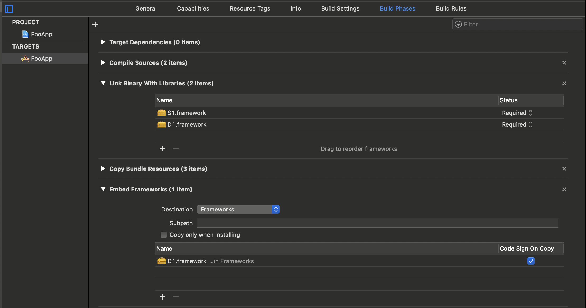
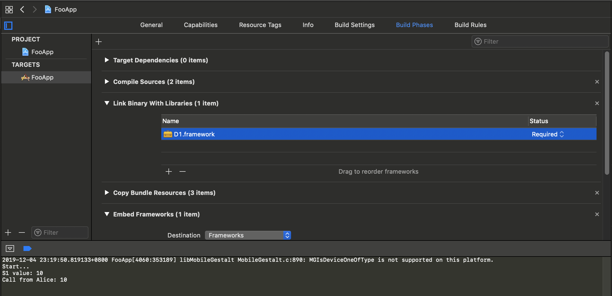
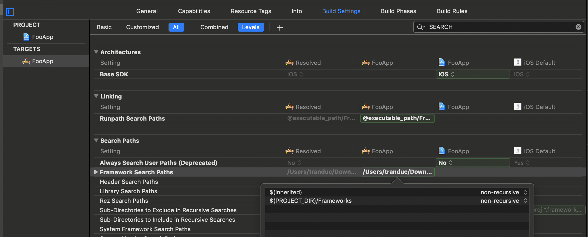
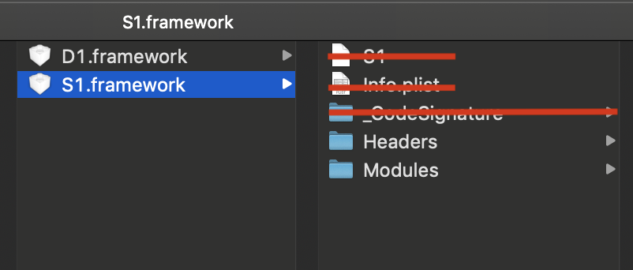
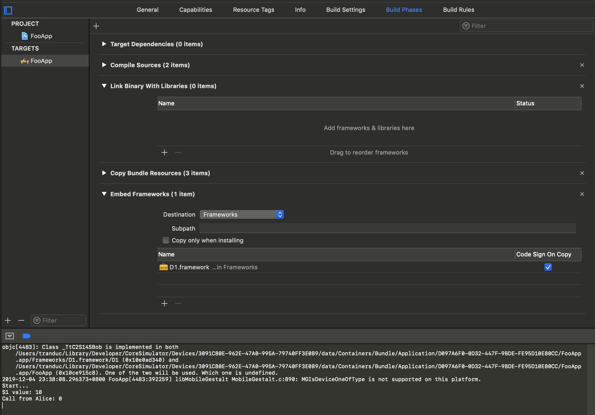

## Linking issues
I did create 2 framework to demostrate linking issues when link static library to a dynamic library: 

- S1 is the static framework
- D1 is the dynamic framework

`S1` was linked to `D1` and is represented like this: `D1 <- S1`

`S1 & D1` are being used by an application named `FooApp`. Linking graph look like bellow:

```
FooApp <- D1 <- S1
FooApp <- S1
```

The problem with that above linking is it would cause duplicated symbols of `S1`, as `S1` is being statically linked to another dynamic libarary(`D1`). Which then both `D1` & `S1` are linked to `FooApp`. And because `D1` is dynamic library, the IDE can't know exactly if `D1` is being linked or not, and when will that one will be available.

But symbols are duplicating only when `S1` is linked to FooApp before `D1`. 
Bellow is the linking setting from project inside `FooAppDuplicatedSymbol` folder:



When reverse the linking order (`D1` is linked before `S1`), this issue was gone. Bellow is the linking setting from project inside `FooAppReverseLinkOrder` folder:


This is the only difference between the 2 projects.

## Let's compare those cases

- Project inside `FooAppDuplicatedSymbol` folder has duplicated symbol error. When running, it will show log like this:

```
objc[3754]: Class _TtC2S14SBob is implemented in both /Users/tranduc/Library/Developer/CoreSimulator/Devices/3091C80E-962E-47A0-995A-79740FF3E0B9/data/Containers/Bundle/Application/6126AAED-F26C-44CB-9C64-C47216AF84C2/FooApp.app/Frameworks/D1.framework/D1 (0x10d054340) and /Users/tranduc/Library/Developer/CoreSimulator/Devices/3091C80E-962E-47A0-995A-79740FF3E0B9/data/Containers/Bundle/Application/6126AAED-F26C-44CB-9C64-C47216AF84C2/FooApp.app/FooApp (0x10cd565c8). One of the two will be used. Which one is undefined.
2019-12-04 22:50:29.095035+0800 FooApp[3754:304043] libMobileGestalt MobileGestalt.c:890: MGIsDeviceOneOfType is not supported on this platform.
Start...
S1 value: 10
Call from Alice: 0
```
--> there're 2 symbols of S1's classes


- Project inside `FooAppReverseLinkOrder` folder is the one does not has this kind of error. When running, it will show log like bellow:

```
2019-12-04 22:52:34.187640+0800 FooApp[3803:307235] libMobileGestalt MobileGestalt.c:890: MGIsDeviceOneOfType is not supported on this platform.
Start...
S1 value: 10
Call from Alice: 10
``` 
--> there's only 1 symbols of S1's classes

Let dig deeper by checking the symbols from executable apps. They're inside the `Output` folder:

- `FooApp-DuplicatedSymbols.app` was built from FooAppDuplicatedSymbol
- `FooApp-ReverseLinkOrder.app` is from FooAppReverseLinkOrder

### FooApp-DuplicatedSymbols.app

Running command `nm /Users/tranduc/Downloads/Foo/Output/FooApp-DuplicatedSymbols.app/FooApp | grep SBob`

Result

```
0000000100003ab0 T _$s2S14SBobC5countSivMZ
0000000100003af0 t _$s2S14SBobC5countSivMZ.resume.0
00000001000039e0 T _$s2S14SBobC5countSivau
0000000100003a10 T _$s2S14SBobC5countSivgZ
0000000100007950 S _$s2S14SBobC5countSivpZ
0000000100003a60 T _$s2S14SBobC5countSivsZ
0000000100003be0 T _$s2S14SBobC7printMeyyFZ
0000000100003b00 T _$s2S14SBobC8setCountyySiFZ
0000000100003e10 T _$s2S14SBobCACycfC
0000000100005b20 S _$s2S14SBobCACycfCTq
0000000100003e60 T _$s2S14SBobCACycfc
0000000100005c90 s _$s2S14SBobCMF
0000000100007948 b _$s2S14SBobCML
0000000100003b90 T _$s2S14SBobCMa
00000001000075b8 d _$s2S14SBobCMf
0000000100007590 D _$s2S14SBobCMm
0000000100005aec S _$s2S14SBobCMn
00000001000075c8 D _$s2S14SBobCN
0000000100003ea0 T _$s2S14SBobCfD
0000000100003e80 T _$s2S14SBobCfd
0000000100005bfe s _symbolic _____ 2S14SBobC
```
### FooApp-ReverseLinkOrder.app

Running command `nm /Users/tranduc/Downloads/Foo/Output/FooApp-ReverseLinkOrder.app/FooApp | grep SBob`

Result

```
                 U _$s2S14SBobC5countSivau
                 U _$s2S14SBobC7printMeyyFZ
                 U _$s2S14SBobC8setCountyySiFZ
                 U _$s2S14SBobCMa
```
`U` means undefined symbol, is the one which will be define by another library (if any, or will be an error at runtime). So for this case, the executable application doesn't contain S1 library.

Find more about nm command [here](https://www.unix.com/man-page/osx/1/nm/)

## What do we get from those things?
It seems Xcode do some smart stubs when linking static framework:

- It would not copy S1 to the executable app if the app already linked by a dynamic (or static) framework which contain S1
- But it check by order, means that if S1 is linked before D1, then Xcode will still copy S1 to the app

## More experiments

### What happens if we don't link S1?
It means only this explicit linking `FooApp <- D1 <- S1`


There will be 2 senarios:

#### 1. If S1 exist in any library search path
Framework search path is a list of folder which Xcode will use to find imported framework. 


For this case, Xcode still can build, but will not copy S1 to the app (means no duplication symbols):

```
2019-12-04 23:19:50.819133+0800 FooApp[4060:353189] libMobileGestalt MobileGestalt.c:890: MGIsDeviceOneOfType is not supported on this platform.
Start...
S1 value: 10
Call from Alice: 10
```

Futher more, Xcode only just need to read S1's header & module map. So we can actually delete other files and folders (include the library) & it still works:


#### 2. If there's no S1 at any place
It then will be an build error, because Xcode can't figure S1's symbols from D1.

### What happens if does not link D1?

#### 1. If D1 still is embeded framework
Xcode still can build, but there's duplicated symbols. So for this case, Xcode can't do that intelligence thing. As a result, Xcode will copy `S1` into the executable file, which causes symbols duplication.



This is the debug log:

```
objc[4483]: Class _TtC2S14SBob is implemented in both /Users/tranduc/Library/Developer/CoreSimulator/Devices/3091C80E-962E-47A0-995A-79740FF3E0B9/data/Containers/Bundle/Application/D097A6F0-0D32-447F-9BDE-FE95D10E80CC/FooApp.app/Frameworks/D1.framework/D1 (0x10e0ad340) and /Users/tranduc/Library/Developer/CoreSimulator/Devices/3091C80E-962E-47A0-995A-79740FF3E0B9/data/Containers/Bundle/Application/D097A6F0-0D32-447F-9BDE-FE95D10E80CC/FooApp.app/FooApp (0x10ce915c8). One of the two will be used. Which one is undefined.
2019-12-04 23:38:08.296373+0800 FooApp[4483:392259] libMobileGestalt MobileGestalt.c:890: MGIsDeviceOneOfType is not supported on this platform.
Start...
S1 value: 10
Call from Alice: 0

```

#### 2. If D1 is not embeded, but still inside Framework search path

Xcode can build, but there will be a run time error. Because D1 is dynamic library, the it need to be shipped along with the app, so the executable file can link it at run time. (It will be coppied to `xxx.app/Frameworks` folder if enable embeded)

Debug log:

```
dyld: Library not loaded: @rpath/D1.framework/D1
  Referenced from: /Users/tranduc/Library/Developer/CoreSimulator/Devices/3091C80E-962E-47A0-995A-79740FF3E0B9/data/Containers/Bundle/Application/ACEBFD95-3CCF-4908-87B4-EAD4348E6C8C/FooApp.app/FooApp
  Reason: image not found
(lldb) 
```

### What if there is one more D2 links to S1?
The link graph will look like bellow:

```
FooApp <- D1 <- S1
FooApp <- D2 <- S1
FooApp <- S1
```

Depends on the linking order, there's some senarios:

#### 1. If `FooApp <- S1` is not the first one

The linking order will be

```
FooApp <- D2 <- S1
FooApp <- D1 <- S1
FooApp <- S1
```

There're duplicated symbols between `D1` & `D2`. S1's classes on FooApp will use the symbols from the first one (so there's no S1's duplicated symbols between `FooApp & D2`). Here is the debug log:

```
objc[5544]: Class _TtC2S14SBob is implemented in both /Users/tranduc/Library/Developer/CoreSimulator/Devices/3091C80E-962E-47A0-995A-79740FF3E0B9/data/Containers/Bundle/Application/F6D48BAA-1D15-4FB6-95FE-274131B4984B/FooApp.app/Frameworks/D1.framework/D1 (0x107f7d340) and /Users/tranduc/Library/Developer/CoreSimulator/Devices/3091C80E-962E-47A0-995A-79740FF3E0B9/data/Containers/Bundle/Application/F6D48BAA-1D15-4FB6-95FE-274131B4984B/FooApp.app/Frameworks/D2.framework/D2 (0x107f72340). One of the two will be used. Which one is undefined.
2019-12-05 00:19:26.155027+0800 FooApp[5544:484967] libMobileGestalt MobileGestalt.c:890: MGIsDeviceOneOfType is not supported on this platform.
Start...
S1 value: 10
Call from Alice: 0
Call from Eve: 10
```

#### 2. if `FooApp <- S1` is the first one

Linking order

```
FooApp <- S1
FooApp <- D1 <- S1
FooApp <- D2 <- S1
```

There're 2 duplicated symbols: `D2 & D1` and `D2 & FooApp` . So each framework/executable will have its own version of `S1` 😭😭😭 . 

Bellow is the debug logs:

```
objc[5608]: Class _TtC2S14SBob is implemented in both /Users/tranduc/Library/Developer/CoreSimulator/Devices/3091C80E-962E-47A0-995A-79740FF3E0B9/data/Containers/Bundle/Application/FCDC2C43-FC20-4D39-B1BB-426B88225EB5/FooApp.app/Frameworks/D2.framework/D2 (0x101512340) and /Users/tranduc/Library/Developer/CoreSimulator/Devices/3091C80E-962E-47A0-995A-79740FF3E0B9/data/Containers/Bundle/Application/FCDC2C43-FC20-4D39-B1BB-426B88225EB5/FooApp.app/Frameworks/D1.framework/D1 (0x101507340). One of the two will be used. Which one is undefined.
objc[5608]: Class _TtC2S14SBob is implemented in both /Users/tranduc/Library/Developer/CoreSimulator/Devices/3091C80E-962E-47A0-995A-79740FF3E0B9/data/Containers/Bundle/Application/FCDC2C43-FC20-4D39-B1BB-426B88225EB5/FooApp.app/Frameworks/D2.framework/D2 (0x101512340) and /Users/tranduc/Library/Developer/CoreSimulator/Devices/3091C80E-962E-47A0-995A-79740FF3E0B9/data/Containers/Bundle/Application/FCDC2C43-FC20-4D39-B1BB-426B88225EB5/FooApp.app/FooApp (0x1012095e0). One of the two will be used. Which one is undefined.
2019-12-05 00:24:39.807895+0800 FooApp[5608:494345] libMobileGestalt MobileGestalt.c:890: MGIsDeviceOneOfType is not supported on this platform.
Start...
S1 value: 10
Call from Alice: 0
Call from Eve: 0
```